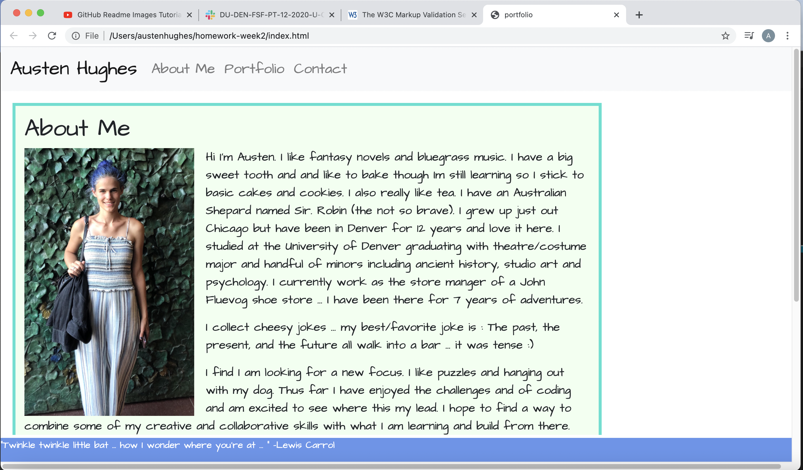

portfolio project

Hi my name is Austen Hughes and this is my portfolio project. the site is organized into the following three pages:

- first is an about me page. Here you will find info about me and links to my github and linkedin. 
- the second is the portfolio itself. the portfolio contains links to projects I have completed. I will build on this as I have things to add.
- the last is a contact page. this page is set up with three submission boxes the first two asking for your name and email respectively the last is a larger space to leave a comment or ask a question. 

to navigate this page you will use the navigation bar at the top. on large viewport you will find the three pages/links listed by name. when the view port is at med or smaller this bar will become a dropdown menu containing the options formerly found on nav bar.

all images in this project can be found in a folder named pictures. This folder can be found inside the asset folder.

you should not have to add anything to your computer to use this site.  

here is the bio page at full size :

